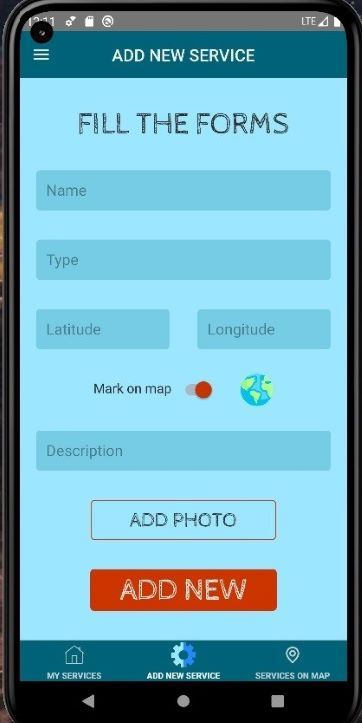

# CIS-Holders

## Description

A mobile application for users temporarily residing abroad, which allows them to search and mark on the map infrastructure facilities where service is available in the user's language. It is possible to search for establishments whose data is stored in the Firebase database. It is also possible to add new places and objects.

## Project Structure

**`Technologies`**: React-native, Typescript, React-native-firebase, React-native-navigation, Redux, Redux-saga, Reselect, React-hook-form, React-native-image-picker, React-native-maps. Eslint and import aliases are set.

The project structure looks like the following:

```text
holders/src
    ├─ assets
    ├─ components
    ├─ constants
    ├─ router
    ├─ models
    ├─ scenes
    │   ├─ Edit
    │   ├─ Map
    │   ├─ Services
    |   └─ About
    ├─ services
    ├─ store
    │   ├─ actions
    │   ├─ reducers
    │   ├─ sagas
    │   ├─ selectors
    │   ├─ types
    |   └─ index.ts
    ├─ styles
    ├─ types
    └─ utils
        ├─ hooks
        └─ helpers
```

## Demo screenshot



## Scripts

### `npm install`

To install all the project dependencies.

### `npm start`

To run the application in development mode (Metro bundler).

### `npm android`

To launch the app on Android device or emulator.

### `npm ios`

To launch the app on iOS device or emulator(only for mac users).

### `npm lint`

To run linter in development mode.
